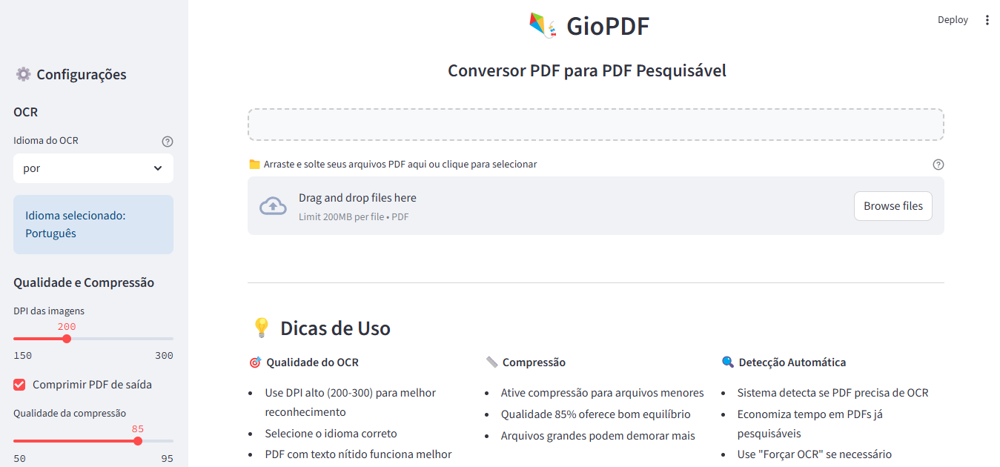
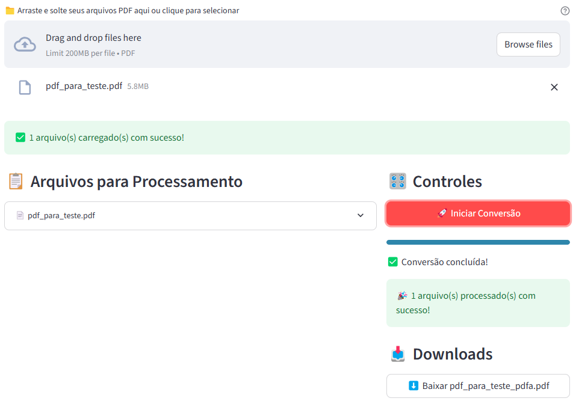

# 🪁 GioPDF

### 📑 Conversor OCR de arquivos PDF para PDF/A

 

**GioPDF** destina-se à conversão _offline_ de arquivos PDF de imagem para arquivos PDF/A pesquisáveis (formato [PDF/A-1b](https://docs.fileformat.com/pt/pdf/a/)).
Seu funcionamento consiste em realizar o reconhecimento ótico de caracteres (OCR) presentes na imagem do arquivo PDF original e **adicionar uma camada de texto**, permitindo a seleção e a cópia do seu conteúdo.

  

Interface gráfica intuitiva do GioPDF

  

### 📥 Baixe a versão compactada do GioPDF

Uma versão funcional do GioPDF que **dispensa instalação** está disponível para [**download aqui**](https://drive.usercontent.google.com/download?id=14KlPM2-SjNISGPWnuEdM4Ks7fB6hd-te).

Descompacte o arquivo **_GioPDF.zip_** e execute o programa clicando duas vezes no arquivo **_abre_giopdf.bat_**. Uma nova aba do navegador será aberta com a interface gráfica do programa.

O arquivo **_GioPDF.zip_** possui aproximadamente 674MB.

O código **SHA-256** de integridade do arquivo é _b063a11c98a67f04c94fba2858a92cb1d0155ac88afcde4fe48eeb503526c2595c9f45db3184e473266389c3c82e554496f9298a7b35cfd3b4e4291b53008f45_. Valide a integridade do arquivo baixado submetendo-o a este [site de verificação](https://emn178.github.io/online-tools/sha512_file_hash.html) e comparando a saída (Output) com o código SHA-256 fornecido.

Arquivo para teste de conversão: [PDF imagem](https://github.com/controlecidadao/GioPDF/raw/refs/heads/main/pdf_para_teste.pdf)

  

Conversão de arquivo PDF para PDF/A no GioPDF

  

### 🪛 Instalação

Caso opte por fazer a instalação usando os arquivos contidos no repositório, confira as instruções [aqui](https://github.com/controlecidadao/GioPDF/blob/main/instala%C3%A7%C3%A3o.txt).

  

### 🛡 Sites seguros para validação de arquivos PDF/A:

* [TCE-ES](https://conformidadepdf.tcees.tc.br/) (verifica também a existência de assinatura digital)

* [TCM-GO](https://tcmgo.tc.br/colare-doc/faces/public/pagInicio.xhtml?dswid=2924) (ferramenta disponível no final da página)

 

